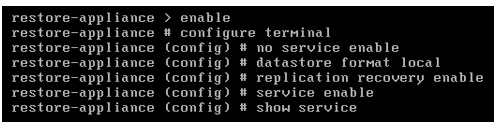

---
copyright:
  years: 2014, 2018
lastupdated: "2018-06-22"

subcollection: virtualization

keywords: disaster recovery
---
{:shortdesc: .shortdesc}
{:new_window: target="_blank"}
{:table: .aria-labeledby="caption"}

# Recovering your VMware vSphere environment
{: #recovering-your-vmware-vsphere-environment}

Data backup is currently the primary method to maintain data safety and integrity. In an ideal and perfect world, their use would never be required.  Unfortunately, the reality is that accidents and disasters do happen.  In the event that they do, it is paramount to minimize system downtime and get back up and running as soon as possible.

In the past, storing backups on high-performance storage or tape were feasible solutions. Today, enterprises are seeking to alleviate the capital and operational costs associated with physical on-premises storage by augmenting or even replacing it with Object Storage. However, with Object Storage, because backups are no longer located on on-premises storage, restoring from them is no longer a matter of simply locating the necessary backup and restoring from it. Fortunately, there is a hybrid solution that performs much of the legwork of restoring backups stored on Object Storage. The solution consists of

* {{site.data.keyword.cos_full}}
* NetApp AltaVault Cloud Storage Gateway from NetApp (formerly Riverbed SteelStore)
* Veeam Backup & Replication software

If a catastrophic event occurs and takes your primary environment offline, a secondary recovery site can be created within {{site.data.keyword.cloud}} to recover it. You can deploy Veeam Backup & Replication software and an AltaVault cloud-integrated storage appliance to communicate with {{site.data.keyword.cos_full_notm}} to access previous backups of the primary environment. The software connects with the storage appliance to restore the backups to a new location, bringing the primary environment back online, and averting any further loss of uptime.

On-premises IP addresses are retained when you restore the virtual machines (VMs) at the {{site.data.keyword.cloud_notm}} recovery site. As a result, it is important to either change IP addresses upon successful recovery or design a BYOIP infrastructure. For assistance in either case, contact your IBM Representative.

The following procedure focuses on the coordinated use of a NetApp AltaVault Cloud Storage Gateway appliance, the {{site.data.keyword.cloud_notm}} infrastructure, and Veeam Backup & Replication to fully restore a VMware vSphere environment failed. The software assumes that at least one backup of the environment was made by using the three preceding technologies and resides on {{site.data.keyword.cos_full_notm}} at the time of recovery.

“AltaVault appliance” is identified two different ways. The first is “on-premises AltaVault appliance,” which refers to the original, on-premises AltaVault appliance that failed and from which backups are recovered and or restored. The second is “{{site.data.keyword.cloud_notm}} AltaVault appliance”, which refers to the AltaVault appliance that is used to recover backups from the failed on-premises AltaVault appliance. The {{site.data.keyword.cloud_notm}} AltaVault appliance deploys to a vSphere environment by using a utility server.

## Introducing a Hybrid Solution
{: #introducing-a-hybrid-solution}

Veeam Backup & Replication enables a hybrid solution, to include NetApp AltaVault cloud-integrated storage appliance and {{site.data.keyword.cos_full_notm}}. The primary concern is to create, maintain, and restore from backups of virtual environments. The NetApp AltaVault cloud-integrated storage appliance is a software solution to seamlessly integrates an on-premises environment with private or public clouds. When used together, Veeam Backup & Replication create backups that the AltaVault cloud-integrated storage appliance stores on local, on-premises storage and simultaneously replicate to {{site.data.keyword.cos_full_notm}}. Additionally, the {{site.data.keyword.cloud}} pay-as-you-go pricing model and full integration with the content delivery network (CDN) offers the ability to store and distribute data across 24 geographically diverse nodes.

### IBM Cloud Object Storage
{: #ibm-cloud-object-storage}

To access the data files that are backed up to {{site.data.keyword.cos_full_notm}}, data files are requested by the following ways:

* The AltaVault appliance already that is located on-premises
* A secondary AltaVault appliance that is located within {{site.data.keyword.cloud_notm}}

Follow this procedure to deploy a secondary AltaVault appliance within {{site.data.keyword.cloud_notm}} to recover a primary, on-premises AltaVault appliance that failed.

The {{site.data.keyword.cloud_notm}} environment consists of a single ESXi host with local storage to house and run the secondary AltaVault appliance. The infrastructure is representative of the basic single-site architecture with a single ESXi host that is managed by a vCenter server within an {{site.data.keyword.cloud_notm}} Virtual Server Instance (VSI).

If you have a more substantial infrastructure that requires shared storage and or support for these features

* vSphere High Availability (HA)
* vSphere Distributed Resource Scheduler (DRS)
* vSphere vMotion

#### Prerequisites
{: #prerequisites-ibm-cloud-object-storage}

Verify that the following prerequisites are met before you proceed: **Note:** For this example, a trial version of an AltaVault AVA-v8 appliance was used with AltaVault Cloud-Integrated Storage 4.1.

* Make sure that the existing environment consists of a single ESXi host that is managed by a vCenter server within an {{site.data.keyword.cloud_notm}} VSI.
* Knowledge of VMware Sphere terminology and administering vSphere ESXi environments. This knowledge includes, but is not limited to, use of the vSphere web client, vSphere client, and assignment of hardware resources to include networking and storage.

#### Order Two Portable Private Networks
{: #order-two-portable-private-networks}

AltaVault requires the network interfaces to be on different networks within the environment. Use the following steps to order two portable private networks through the {{site.data.keyword.slportal_full}}.

1. Access the [{{site.data.keyword.slportal_full}} ](https://control.softlayer.com/){: new_window} by using your unique credentials.
2. Click **Account > Place an Order**.
3. Select the **Network** section click **Subnets/IPs > Order**.
4. From the drop-down menu, select **Portable Private**. Selecting Portable Private triggers an option to select the number of portable private IP addresses to display. **Note:** {{site.data.keyword.cloud_notm}} automatically reserves at least three IP addresses in the address block for each portable private network. The reserved addresses are for the network address, gateway address, and broadcast address. These addresses must be bound directly to the virtual LAN (VLAN). <!--If your IBM Cloud pod supports Hot Standby Ready Protocol (HSRP), then the number of usable IP addresses is reduced. For instance, if you select **4 Portable Private IP Addresses** will yield only one usable IP address or zero if the pod supports HSRP.--> For more information about portable IP addresses, see [Getting started with Subnets and IPs](/docs/infrastructure/subnets?topic=subnets-getting-started-subnets-ips#getting-started-subnets-ips).
5. Click **Continue** after you select the number of portable private IP addresses.
6. Select the VLAN where the portable private IP addresses to be routed and click **Continue**.
7. Complete the required contact information and click **Place Order**.
8. Repeat the ordering process to obtain the second required portable private network.
9. Click **Network > IP Management > Subnets** from the {{site.data.keyword.slportal}} page to view your portable private networks and IP addresses after they are allocated. It is recommended to track your IP address assignments. Use the **Notes** section of the **Subnets** page for each IP address to reflect the machine to which it is assigned.

#### Configuring vSphere
{: #configuring-vsphere}

You need to configure vSphere to reflect the addition of the portable private networks and make sure that they are logically segregated.

1. Go to your vSphere environment and create a virtual machine port group to reflect the addition of one of the portable IP blocks (two in total).

Virtual machine port group is labeled **Share Network**. One portable IP block is used for VMs that are placed on the default (primary) virtual machine port group. The other is used for data transfer between an AltaVault appliance and an exported Common Internet File System (CIFS)/Server Message Block (SMB) mount point.

## AltaVault Cloud Storage Gateway
{: #altavault-cloud-storage-gateway}

You can use AltaVault to integrate your on-premises environment with the cloud without the need to write scripts or applications by using REST APIs for {{site.data.keyword.cos_full_notm}}. AltaVault exposes a CIFS/SMB or Network File System (NFS) mount point on the front end and securely connects to the {{site.data.keyword.cos_full_notm}} interface on the back end. You can then mount or point to the mount points and copy data into and or recovering/restoring environments from the cloud securely.<!-- , as shown in Figure 1.-->

<!-- 
 `Figure 1: AltaVault end-to-end flow with Veeam and IBM Cloud`-->

### Deploying AltaVault in a Disaster Recovery Configuration
{: #deploying-altavault-in-a-disaster-recovery-configuration}

Follow these steps to deploy AltaVault as a disaster recovery solution with {{site.data.keyword.cos_full_notm}}.

#### Before you get started
{: #before-you-get-started-deploying-altavault-in-a-disaster-recovery-configuration}

Verify that the following prerequisites are met before you proceed:

* Obtain a copy of AltaVault Virtual Appliance and make sure that it resides on the utility server. It is a single file with an OVA file extension. Contact your NetApp representative for the appliance, or download a 90-day trial version from the [NetApp AltaVault website ](https://www.netapp.com/us/products/protection-software/altavault/){: new_window}.
* Have an existing on-premises vSphere ESXi 5.5 environment with the minimum CPU, memory, and disk space requirements available for the AltaVault appliance. If you use the trial version, here are the resource requirements: four virtual CPUs (vCPUs), 24 GB of memory, and up to 8 TB of disk space.
* Have two 10 Gbps network interface controllers (NICs) available within the vSphere environment. One NIC is used for data access, and the other is used for data replication to {{site.data.keyword.cos_full_notm}}.
* Have two portable private networks that correspond to the two NICs that are defined within the vSphere environment. The replication network cannot be assigned to the same network as the data access network, which can create a routing loop.
* Have {{site.data.keyword.cos_full_notm}} credentials. These credentials include an {{site.data.keyword.cloud_notm}} username, {{site.data.keyword.cos_full_notm}} username, and the API key that is associated with the {{site.data.keyword.cloud_notm}} username.
* Suspend data replication on the on-premises AltaVault appliance or disconnect it from the container/bucket that is used to access the backup archive in {{site.data.keyword.cloud_notm}} if the on-premises environment is still intact.
  * Use one of the two following methods to suspend or stop replication:
    * Turn off the on-premises AltaVault appliance.
    * Go to the AltaVault appliance web management console and click **Storage > Cloud Settings > Replication**. Select **Suspend Replication**.
    * Obtain a copy of the configuration file of the on-premises AltaVault appliance or have it accessible through a URL. The configuration file is a .tar file.
  * Go to the AltaVault appliance web management console and click **Configure > Setup Wizard > Export Configuration > Export Configuration**. Save the configuration file (.tar file) and either transfer it to the utility server or make it accessible through a URL.
    * Knowledge of VMware Sphere terminology and administering vSphere ESXi environments. This knowledge includes, but is not limited to, use of the vSphere web client, vSphere client, and assignment of hardware resources such as networking and storage.

### Deploying AltaVault OVA
{: #deploying-altavault-ova-disaster}

Deploy the AltaVault OVA to the vSphere environment by using the utility server after all of the prerequisites are met. Instructions for OVA deployment can be found in the [NetApp AltaVault Installation and Service Guide ](https://library.netapp.com/ecm/ecm_download_file/ECMLP2317733){: new_window}. The trial version of AltaVault comes configured with four virtual CPUs, 6 GB of memory, and a 150 GB primary disk. Use the Installation and Service Guide to do the following steps:

1. Increase the amount of memory to 24 GB.
2. Add a secondary disk storage device that is less than or equal to 8 TB in size to store deduplicated backup data.
3. Assign different portable private networks to the AltaVault appliance after the memory and disk configurations are changed.

The NICs are assigned the following interface functions:

* **Primary**: Used for the AltaVault appliance management and data replication to the cloud. It is assigned the **Primary Network** port group in the example environment.
* **e0a**: An optional interface that is used to replicate data from the AltaVault appliance to the cloud.
* **e0b**: An interface that is used to export the mount point for the SMB/CIFS or NFS share. It is assigned the **Share Network** port group in the example environment.
* **e0c**: An optional interface that is used to export the mount point for the SMB/CIFS or NFS share.

In the example configuration in this procedure, the AltaVault appliance uses the **Primary** interface as the replicate-to-cloud interface and the **e0b** interface to export a CIFS/SMB mount point. **Note:** You cannot use both A CIFS/SMB share and an NFS share to access the same data. The protocol that is used must be the same as the protocol that is used with the on-premises AltaVault appliance to replicate data to the cloud.

<!-- 
 `Figure 2: IBM Cloud setup with VMware`-->

For more information on the deployment of the AltaVault appliance and configuration of the VM settings, see [NetApp AltaVault Installation and Service Guide ](https://library.netapp.com/ecm/ecm_download_file/ECMLP2317733){: new_window}.

### Configuring the AltaVault Appliance
{: #configuring-the-altavault-appliance}

1. You can power on the AltaVault VM after it is configured. It can take some time for the VM to start as the AltaVault appliance is formatting the auxiliary storage disk.

2. Log in to the AltaVault console using **admin** as the **Username** and **password** as the **Password** once the appliance has completed the boot process. You can change these credentials after completing the initial configuration. See Table 1: AltaVault initial configuration values

3. After you log in to the appliance, you are asked whether you want to use the wizard for configuration. Enter *y*.
4. Use the information in Table 1 after you enter the wizard.
5. Press **Enter** to save your changes.

|Question|Answer|
|---|---|
|Step 1: Admin Password?|Enter a new admin password (cannot be **password**).|
|Step 2: Hostname?|Enter the appropriate hostname.|
|Step 3: Use DHCP on primary interface?|Enter **n** or **no**.|
|Step 4: Primary IP Address?|Enter the primary network IP address. In the example configuration, this is the network used for the management interface (e.g., 10.120.108.132).|
|Step 5: Netmask?|Enter the netmask (e.g., 255.255.255.192).|
|Step 6: Default gateway?|Enter the default gateway (e.g., 10.120.108.129).|
|Step 7: Primary DNS server?|Enter the primary Domain Name System (DNS) server in your environment.|
|Step 8: Domain name?|Enter the domain name of your environment (e.g., testenv.org).|
{: caption="Table 1. AltaVault initial configuration values" caption-side="top"}

### Configuring AltaVault for IBM Cloud Object Storage
{: #configuring-altavault-for-ibm-cloud-object-storage}

The AltaVault appliance must be connected to the {{site.data.keyword.cos_full_notm}} service after it is setup. In the on-premises configuration, the public DNS is used to connect to the Object Storage Service. In this configuration, the internal DNS name is used instead.

1. Open a web browser and enter the IP address of the AltaVault appliance.
2. Log in to the console with the admin credentials. Upon initial login, the **Wizard Dashboard** will be displayed.
3. Select **System Settings** and verify that all network settings are correct and adjust the time zone to reflect the time zone of your environment.
4. Select **Next > Save and Apply > Exit**. You return to the **Wizard Dashboard** and are logged out of your current browser session.
5. Log back in to the AltaVault appliance and click **Settings > Setup Wizard > Import Configuration** and specify the location of the configuration file of the on-premises AltaVault appliance.
6. Select **Import Shared Data Only**, which imports only settings shared in common, such as cloud and email settings.
7. Enter the passphrase for the encryption key that is specified during the creation of the on-premises AltaVault appliance, if one was set, in the **Key Passphrase** text box.
8. Click **Import Configuration > Exit**.

<!--The AltaVault appliance web console displays a message indicating a successful import. If the import was not successful, verify that the configuration file is in the correct format and that the passphrase is correct before trying again.-->

You have imported the on-premises AltaVault appliance configuration to the {{site.data.keyword.cloud_notm}} AltaVault appliance.

Use the following steps to modify the cloud settings of the {{site.data.keywrod.cloud_notm}} AltaVault appliance to give it access to the {{site.data.keyword.cos_full_notm}} service via the private network.

1. In AltaVault, go to **Storage > Cloud Settings > Cloud** and modify the host name to reflect the private address of the {{site.data.keyword.cos_full_notm}} service.
  * The private network name syntax is <location>.objectstorage.service.networklayer.com, where *<location>* designates the shortened data center name (example: mel01 for the Melbourne 01 data center).
2. Click **Apply**. The AltaVault appliance attempts to connect to the {{site.data.keyword.cos_full_notm}} service. If this connection attempt fails, verify that the cloud provider settings are correct before you try to connect again.

After you connect to {{site.data.keyword.cos_full_notm}}, the appliance needs to be placed in recovery mode to sync the metadata content of the original backup data from {{site.data.keyword.cos_full_notm}}.

Use the following steps to place the AltaVault appliance in recovery mode.

The AltaVault appliance syncs data from {{site.data.keyword.cos_full_notm}}. **Note:** The time it takes to complete the sync depends on the size and number of backups that are being restored.

1. Go to the AltaVault appliance, log in, and enter the commands that are shown in Figure 3:  `Figure 5: Recovery mode commands`
2. Return to the AltaVault appliance web console after the sync process completes.
3. Verify that the **Storage Optimization Service** is **running** and that its **Status** is **ready**. It might take a few minutes for the **Status** to change to **ready**.

### Configure the CIFS/SMB Mount Point in AltaVault
{: #configure-the-cifs-smb-mount-point-in-altavault}

After the internal connection to {{site.data.keyword.cos_full_notm}} is established, configured the **e0b** interface to access a CIFS/SMB mount point.

1. In the AltaVault web console, go to **Settings > Data Interfaces**.
2. Expand the **e0b** interface and select **Enable Data Interface**, if necessary.
3. Enter the IP address, subnet mask, and gateway that you want to use to mount the CIFS/SMB share. Make sure to use a different subnet than the one that is used for the primary interface.
4. Leave the default **MTU** value of **1500 bytes**.
  * Although the default maximum transmission unit (MTU) is 1,500, you can change it to 9,000 if you are using jumbo frames. Your ESXi host and physical infrastructure need to support jumbo frames. By default, {{site.data.keyword.cloud_notm}} supports an MTU size of 9,000 bytes with no configuration changes needed.
5. Click **Apply**.

The AltaVault appliance is now minimally configured to allow communications between itself, {{site.data.keyword.cos_full_notm}}, and Veeam Backup & Replication.

## Veeam Backup & Replication
{: #veeam-backup-replication-recover}

Veeam Backup & Replication software provides complete backup, replication, and recovery capabilities for VMs and their data. Veeam Backup & Replication can be fully integrated with an AltaVault Cloud Gateway Appliance, making for a seamless backup and recovery experience.

### Deploy Veeam Backup & Replication
{: #deploy-veeam-backup-replication}

A trial version of Veeam Backup & Replication Version 8 is used in the example.

#### *Prerequisites*
{: #prerequisites-deploy-veeam-backup-replication}

Before you proceed with deployment, make sure that the following prerequisites are satisfied:

* Have an existing AltaVault appliance that is configured for use with IBM Cloud Object Storage and Veeam Backup & Replication.
* Obtain a copy of Veeam Backup & Replication for VMware environments, which is a single executable file. Contact your Veeam Representative for a copy or download a [30-day trial version ](https://www.veeam.com/vm-backup-recovery-replication-software.html){: new_window}.
* Obtain a license file for use with Veeam Backup & Replication. In most cases, this file is emailed to the email address that was used to download Veeam Backup & Replication. If you did not receive this file, contact your Veeam Representative.  The license file is used to activate full Veeam Backup & Replication functionality. If this file is not supplied during program installation, all features and functionality revert to those of the 30-day trial version.
* Have a virtual server instance (VSI) provisioned in IBM Cloud with the specifications in Table 2. **Note:** The installed operating system must be a 64-bit version.

||Minimum|Recommended|
|---|---|---|
|**OS**|<ul><li>Windows Server 2012 R2</li><li>Windows Server 2012</li><li>Windows Server 2008 R2 SP1</li><li>Windows Server 2008 SP2</li><li>Windows 8.x</li><li>Windows 7 SP1</li></ul>|<ul><li>Windows Servers 2012 R2</li><li>Windows Server 2012</li><li>Windows Server 2008 R2 SP1</li><li>WIndows 2008 SP2</li><li>Windows 8.x</li><li>Windows 7 SP1</li></ul>|
|**# of cores or vCPUs**|2|4|
|**Memory**|4 GB base RAM plus 500 MB for each concurrent backup and restore job.|16 GB base RAM plus 4 GB for each concurrent backup and restore job.|
|**Disk space**|2 GB for product installation, 10 GB per 100 VMs for guest system catalog folder (persistent data).|2 GB for product installation, 10 GB per 100VMs for guest system catalog folder (persistent data).|
|**Network**|1 Gbps LAN for onsite backup and replication, 1 Mbps WAN for off-site backup and replication.|1 Gbps LAN for onsite backup and replication, 1 Mbps WAN for offsite backup and replication.|
{: caption="Table 2. System requirements for {{site.data.keyword.cloud_notm}} VSI" caption-side="top"}

Provision the VSI within the same data center as the AltaVault appliance and vSphere environment. The VSI must have access to the AltaVault appliance and vCenter.

### Installing Veeam Backup & Replication
{: #installing-veeam-backup-replication-disaster}

Use the following steps to install Veeam Backup & Replication to the {{site.data.keyword.cloud_notm}} VSI after all of the prerequisites are met.

1. Double-click the program executable and click **Veeam Backup & Replication – Install**. The setup wizard opens.
* Click **Next** and select **I accept the terms in the license agreement** .
* Click **Next** and specify the location of the license file that is obtained under Deploy Veeam Backup & Replication.
* Click **Next** and select which Veeam Backup & Replication components that you want installed and their installation location on the **Program Features** screen. **Note:** **Veeam Backup & Replication** and **Veeam Backup Catalog** are required components.
* Click **Next**. The setup wizard runs a series of checks to make sure that all required program frameworks and supporting components are installed. If any components are missing, the setup wizard offers to install them. <!--Click **Install** if this is the case.-->
2. Verify that all components **Passed** the systems check and click **Next**.
3. Select the **Service (user) Account** that you want the Veeam Backup Service to run. The default service account is the **LOCAL SYSTEM account**. Click **Next**.
4. Select the **SQL Server Instance** that you want to use to create and store Veeam Backup & Replication databases. For more information, contact your database administrator. Click **Next**.
5. Enter the **Catalog service port** (9393) and **Veeam Backup service port** (9392). Click **Next**.
6. Select the directories where you want to store the guest file system catalog (persistent data) and vPower NFS write cache (non-persistent data). Click **Next**.
7. Verify that all settings and values are correct and click **Install**. After the installation is done, click **Finish**.

### Configuring Veeam Backup & Replication
{: #configuring-veeam-backup-replication}

After Veeam Backup & Replication installs, you are ready to connect with the AltaVault appliance.

1. Launch Veeam Backup & Replication.
2. On the lower-left side of the screen, click **Backup Infrastructure**.
3. In the **Backup Infrastructure** window, click **Managed Servers > Managed servers**.
4. From the upper ribbon menu, click **Add Server** and double-click **VMware vSphere**.
5. Enter the private IP address of the vSphere server and click **Next**.
6. Enter the account credentials of a local account with administrator privileges on the vSphere server that is specified previously. **Note:** The account username must be in DOMAIN\USER format for domain accounts, or HOST\USER format for local accounts. To add an account, click **Add** and enter the appropriate username and password. Do not change the default VMware web services port unless your network administrator tells you to. <!-- otherwise during [Veeam Backup & Replication installation](#_Installing_Veeam_Backup).--> Click **Next**.
  * Veeam Backup & Replication attempts to connect to the vSphere server. If the connection attempt fails, check that the account exists and has administrator privileges on the vSphere server before you try again.
7. Click **Finish**.
8. Verify that the vSphere server is successfully added by clicking **Managed Servers > VMware vSphere**.

### Adding a Backup Repository to Veeam Backup & Replication
{: #adding-a-backup-repository-to-veeam-backup-replication-disaster}

Follow these steps to create a new backup repository to store restored backups on the AltaVault appliance. **Note:** A CIFS/SMB share is used for the example because the Veeam Backup & Replication backup server must be hosted on a machine that is running Windows. The share protocol that is used for restoring backups in the {{site.data.keyword.cloud_notm}} AltaVault appliance must be identical to the share protocol that is used for those same backups in the on-premises AltaVault appliance, a CIFS/SMB share is used.

1. In the lower-left corner, click **Backup Infrastructure > Backup Repositories**.
2. From the upper ribbon menu, click **Add Repository**.
3. Give the repository a unique **Name** and give an appropriate **Description**. Click **Next**.
4. Select the share type that corresponds to the share type that is used in the on-premises AltaVault appliance. Example: if the share type that is used in the on-premises AltaVault appliance is CIFS/SMB, select **Shared folder**.
5. Specify the location where you want the backups of the CIFS/SMB share to be restored on the AltaVault appliance. The share has the same name as the share through which backups were processed on the on-premises AltaVault appliance. For example, if the share named `cifs_test1` is used for backups in the on-premises AltaVault appliance, then specify the location of the `cifs_test1` share on the {{site.data.keyword.cloud_notm}} AltaVault appliance.
  * Open a web browser and enter the IP address of the AltaVault appliance to determine the location.
  * Go to **Storage > CIFS** and take note of the **Share Path** of the share. **Note:** This is NOT the same as the local path of the share. The share path format is `\\<AltaVault appliance hostname>\<share name>`. Replace the AltaVault appliance hostname in the Share Path needs with the IP address of the e0b network interface (the mount point of the share) of the AltaVault appliance. 
   * Click **Settings > Data Interfaces** in the AltaVault appliance management window to find the IP address of the **e0b** interface. For more information about configuring IFS/SMB mounts, see Configure CIFS/SMB Mount Point in AltaVault.
   * The share path specified in Veeam Backup & Replication would be `\\10.120.108.133\cifs_test1`, not `\\restore-appliance\cifs_test1`.
6. Return to Veeam Backup & Replication, input the share path of the mount point in the **Shared folder** field, and click **Next**. Veeam Backup & Replication attempts to establish a connection with the mount point. If the connection fails, go back and verify the network settings for the AltaVault appliance are correct before you try again.
7. Enter a value to **Limit maximum concurrent** tasks to the number of resources available on the **New Backup Repository** screen. This value is the maximum number of tasks a backup proxy can send to the selected share. The default number of concurrent tasks is four. AltaVault recommends that you start with five concurrent tasks and increasing or decreasing this value as resources allow.
8. Click **Next**.
9. Specify the optional vPower NFS settings on the **vPower NFS** screen. If the **Enable vPower NFS server** checkbox is left unselected, then Veeam Backup & Replication uses vPower for recovery and recovery verification. Click **Next**.
10. Select **Import existing backups automatically**, unless you use manual selection of VM backups.
11. Verify that all settings are correct, and click **Next**.
* Click **Finish** to exit the wizard.
12. Click **Yes** to continue.

Veeam Backup & Replication is configured and you can begin restoring backups.

### Restoring the Environment
{: #restoring-the-environment}

Follow these steps to fully restore a VM restore.

1. In the lower-left of the screen, click **Backup & Replication**.
2. From the upper ribbon menu, click **Restore**.
3. Select **Entire VM (including registration)**. **Note:** Do not make any selection under **Restore from replica**. Click **Next**.
4. Click **Add VM > From Backup**. You see the VMs that were previously replicated to {{site.data.keyword.cos_full_notm}} via the on-premises AltaVault appliance and the selected CIFS/SMB share. Click **Add > Next**.
5. Restore the VMs to a new location <!--[because the original location of the VM(s) failed]--> by selecting **Restore to a new location, or with different settings**. Click **Next**.
6. From the **Host** screen, select a target host for each VM that you are restoring. Select a VM and then click **Host**.
7. Select the target host from the **Select Host** and click **OK**. Veeam Backup & Replication attempts to contact the target hosts to make sure that they are online and ready to receive data. If this attempt fails, verify that all network settings are correct before trying again. After the check completes, click **Next**.
8. Select an optional **Resource Pool** for each VM. Click **Next**.
9. Select a target datastore and disk type for each VM that you are restoring. Click **Next**. Veeam Backup & Replication attempts to validate the target datastores. If the validation fails, check that the datastore has enough capacity for the VMs that are being restored  and verify that all network settings before trying to connect again.
10. Select a destination folder on the target datastores for each VM that you want restore. Click **Next**.
11. Specify network connections and settings for each VM. Click **Next**.
12. Enter an optional **Restore reason** giving a reason why you are performing the restore operation. Click **Next**. Veeam Backup & Replication attempts to validate the VMs that you are restoring. Wait for this validation to finish successfully before you proceed.
13. Verify the restore operations and settings in the **Backup & Replication** window and click **Finish**. Veeam Backup & Replication automatically begins restoring the selected VMs.

## Next steps
{: #next-steps-recovering-your-vmware-vsphere-environment}

<!--The recent rise in Object Storage can be heavily attributed to enterprises' desire to reduce or even eliminate the operational and capital expenditures associated with comparatively expensive on-premises storage. While Object Storage is a highly cost-effective solution, it introduces a new problem of how to access stored files. In the case of stored data backups, the issue is how to use them to recover an environment that has failed for whatever reason.-->

<!--This problem is handily resolved by Veeam Backup & Replication, along with a NetApp AltaVault Cloud Gateway appliance, and {{site.data.keyword.cos_full_notm}}. When used together, they create a seamless backup and recovery experience that can be tailored to fit a wide variety of environmental requirements and constraints. By following the steps outlined in this procedure, enterprises can quickly realize the benefits of cloud-based storage, while reducing the complexities involved in shifting from on-premises storage to Object Storage using the three aforementioned technologies.-->

For more information about the components of this hybrid solution see:

* [NetApp AltaVault website ](https://www.netapp.com/us/products/protection-software/altavault/){: new_window}
* [Veeam Backup & Replication website ](https://www.veeam.com/vm-backup-recovery-replication-software.html){: new_window}
* [IBM Cloud Object Storage website ](https://www.ibm.com/cloud/storage){: new_window}

*Utility server* refers to a server that contains the VMware vSphere Client that is used to access a private environment and through which the AltaVault appliance that is used for data recovery operations are deployed.
